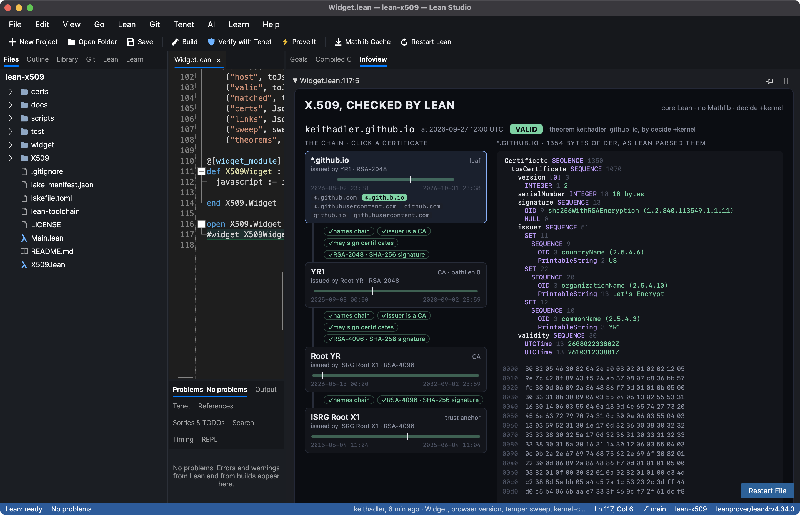
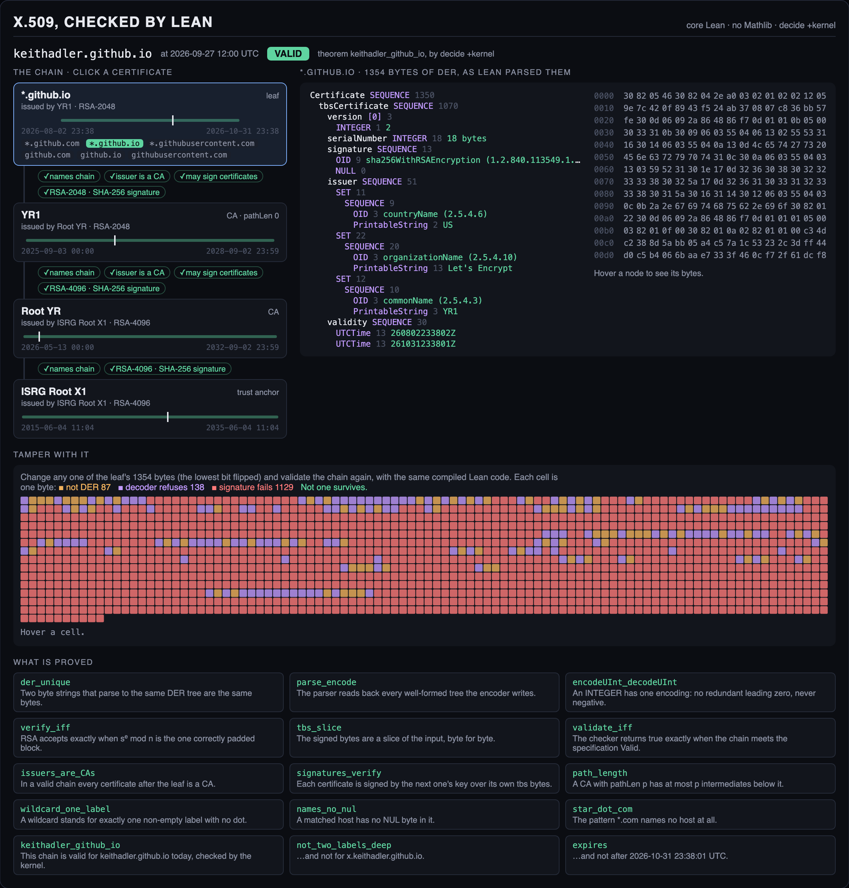

# X.509, checked by Lean

Lean's kernel validates a real certificate chain, from the raw DER bytes to the RSA signatures, and the
parser underneath is proved to accept exactly one encoding of every certificate.



    *.github.io  ←  Let's Encrypt YR1  ←  ISRG Root YR  ←  ISRG Root X1

That is the chain [keithadler.github.io](https://keithadler.github.io) served on 2026-09-27: RSA-2048 and
RSA-4096, SHA-256 throughout. `X509/Real.lean` states, and Lean's kernel proves by `decide +kernel`, that
the chain is valid for `keithadler.github.io` at 12:00 UTC that day. To get there the kernel parses about
4,700 bytes of DER, hashes each signed part with SHA-256, raises each signature to the public exponent
modulo a 2048- or 4096-bit key, compares the result with the one correctly padded block, and checks
names, dates, CA flags, key usages, path lengths and the host name. No compiled code is involved, and
Tenet, Lean Studio's independent kernel, checks the same proofs again.

Everything is in core Lean 4.34, no Mathlib, so it builds in a few minutes (most of it the kernel
checking the chain).

## What is proved

| Theorem | What it says |
| --- | --- |
| `der_unique`, `encode_parse` | Two byte strings that parse to the same DER tree are the same bytes. No long-form length where a short one fits, no leading zeros in a length, no indefinite length, no trailing bytes. |
| `parse_encode` | The parser reads back every well-formed tree the encoder writes. |
| `encodeUInt_decodeUInt`, `decodeBool_iff` | An INTEGER and a BOOLEAN each have one encoding. |
| `utc_window`, `generalized_before_2050_refused` | RFC 5280's time rules: `49` is 2049 and `50` is 1950, and dates before 2050 may only be UTCTime. |
| `verify_iff` | RSA PKCS #1 v1.5 accepts exactly when `sᵉ mod n` equals the one correctly padded block. Nothing in the block goes unread, which rules out Bleichenbacher's 2006 forgery against lenient padding checks. |
| `tbs_slice` | The bytes a signature is checked over are a slice of the input, byte for byte. |
| `validate_iff` | The checker returns true exactly when the chain meets `Valid`, a plain specification of RFC 5280 §6.1 for a TLS server. |
| `issuers_are_CAs`, `issuers_may_sign` | In a valid chain every certificate after the leaf is a CA allowed to sign certificates. |
| `names_chain`, `signatures_verify` | Each certificate names the next as its issuer and carries a signature by its key over its own bytes. |
| `path_length`, `all_current` | Path-length constraints hold, and no certificate is expired or not yet valid. |
| `wildcard_one_label` | A wildcard stands for exactly one non-empty label with no dot in it. |
| `names_no_nul`, `host_has_no_nul` | A matched host has no NUL byte (the `paypal.com\0.evil.com` trick). |
| `star_dot_com` | `*.com` names no host at all. |
| `refuses_long_form`, `refuses_indefinite`, `refuses_tag_escape`, … | The classic ways of writing DER wrong, each refused, checked by the kernel. |
| `sha256_abc`, `sha256_empty`, `sha256_two_blocks` | SHA-256 gives FIPS 180-4's answers. |
| `keithadler_github_io` | The real chain is valid for keithadler.github.io on 2026-09-27. |
| `not_two_labels_deep`, `not_evil_com`, `expires` | It is not valid for `x.keithadler.github.io`, for `evil.com`, or after the leaf expires. |

## Tests

The proofs cover the definitions. The tests check that those definitions behave on real inputs the way
the rest of the world expects.

- **Every root in the macOS trust store** (`test/differential.py`): all 128 decode, and every field (serial, dates, CA flag, path length, DNS names, key size and exponent) agrees with OpenSSL. All 54 self-signed RSA/SHA-256 roots verify their own signatures in both.
- **Malformed and tampered certificates** (`test/negative.py`): 20 variants of the real leaf, each wrong in one way, all refused (table below).
- **Every one-byte change of the leaf** (`x509 sweep`, shown in the widget): flip the lowest bit of each of the leaf's 1,354 bytes in turn and validate again. None survives: 87 stop being DER, 138 are refused by the decoder, 1,129 fail the RSA signature.
- **Mutants** (`test/mutants.py`): 25 plausible bugs put in on purpose, one at a time. All 25 are caught, 20 of them by a proof or a kernel check failing (`test/mutants.log`).
- **Axioms** (`test/Axioms.lean`): 477 declarations, 162 theorems, resting only on Lean's three standard axioms: no `sorry`, no `native_decide`.
- **Tenet**: Lean Studio's independent kernel re-checks all 375 of the project's declarations, the real chain included: 375 verified, 0 rejected.

OpenSSL is shown for comparison. For three of these (a zero-padded length, BER's indefinite length, a
trailing byte) it reads the altered bytes as the original certificate: the same certificate from
different bytes, which is the malleability DER exists to rule out.

| Changed | Lean | OpenSSL |
| --- | --- | --- |
| long-form length where one byte fits | rejected | parses, fails verify |
| length with a leading zero byte | rejected | parses, verifies |
| indefinite length (BER) | rejected | parses, verifies |
| a byte after the certificate | rejected | parses, verifies |
| reserved length byte 0xFF | rejected | refuses |
| multi-byte tag escape 0x1F | rejected | parses, fails verify |
| serial with a redundant leading zero | rejected | refuses |
| version v1 written out explicitly | rejected | parses, fails verify |
| BOOLEAN TRUE as 0x01 | rejected | parses, fails verify |
| critical FALSE written out | rejected | parses, fails verify |
| the same extension twice | rejected | parses, fails verify |
| an unknown critical extension | rejected | parses, fails verify |
| GeneralizedTime for a 2026 date | rejected | parses, fails verify |
| February 30 | rejected | parses, fails verify |
| inner and outer signature algorithms differ | rejected | parses, fails verify |
| an OID padded with 0x80 | rejected | refuses |
| an OID whose last byte says more follows | rejected | refuses |
| one bit of the signature flipped | invalid | parses, fails verify |
| one letter of a DNS name changed | invalid | parses, fails verify |
| leaf rewritten to claim cA = TRUE | invalid | parses, fails verify |

## Try it

1. Install [Lean Studio](https://github.com/keithadler/leanstudio) (on a Mac: `brew install --cask keithadler/tap/lean-studio`).
2. Clone this repository, open the folder, and run **Build**.
3. Open `X509/Widget.lean`, click the last line (`#widget X509Widget with widgetProps`) and choose the
   **Infoview** tab.

It works the same in VS Code with the Lean 4 extension. Without Lean there is a
[browser version](https://keithadler.github.io/lean-x509/) of the widget, fed the data Lean computes,
including the tamper sweep:



```sh
lake build                       # the proofs, including the kernel checking the chain
lake exe x509 show cert.der      # the same code, compiled: one JSON line per certificate
python3 test/differential.py     # against OpenSSL, over /etc/ssl/cert.pem
python3 test/negative.py         # malformed and tampered certificates
python3 test/mutants.py          # break the code on purpose, see what notices
lake env lean test/Axioms.lean   # which axioms everything rests on
```

## What it does not cover

Revocation (CRLs and OCSP), name constraints and policy processing (a certificate that marks either one
critical is refused), path building (the chain is checked in the order it is presented), and signature
algorithms other than RSA with SHA-256, so ECDSA chains are out of reach for now. Names are compared byte
for byte, which is stricter than RFC 5280's case-folding comparison. Only single-byte tags are read, which
is all X.509 uses. RSA verification is proved equal to its definition, not proved secure: that rests on
the RSA assumption, as it does everywhere. The real chain is checked at one fixed moment.

## Related work

Verified X.509 is not new. [ARMOR](https://github.com/joyantaDebnath/ARMOR) (Agda, IEEE S&P 2024) and
[Verdict](https://github.com/secure-foundations/verdict) (Verus, USENIX Security 2025) verify parsing and
chain validation, and [ASN1*](https://www.microsoft.com/en-us/research/publication/asn1-provably-correct-non-malleable-parsing-for-asn-1-der/)
(F*, CPP 2023) proves DER parsing non-malleable. In Lean,
[tls13-lean](https://github.com/pb64-lean/tls13-lean) includes an X.509 decoder and path validation
alongside its TLS 1.3 engine. What this project adds is the combination: DER canonicity for whole trees in
Lean, and Lean's own kernel checking a real chain end to end, cryptography included.

## Files

- `X509/Der.lean`: DER trees, the encoder, the parser, canonicity
- `X509/Prim.lean`: INTEGER, BOOLEAN, UTCTime and GeneralizedTime
- `X509/Sha256.lean`, `X509/Rsa.lean`: SHA-256 and RSA PKCS #1 v1.5, on `Nat` so the kernel can run them
- `X509/Cert.lean`: reading a certificate (RFC 5280 §4)
- `X509/Host.lean`: host-name matching (RFC 6125 and RFC 9525)
- `X509/Chain.lean`: the specification `Valid`, the checker `validate`, and what a valid chain guarantees
- `X509/Real.lean`: the real chain; `X509/Data.lean` holds its bytes (`scripts/embed.py` writes it from `certs/`)
- `X509/Widget.lean`, `widget/X509.js`: the widget; `docs/` is its browser version (`scripts/build-docs.sh`)
- `Main.lean`: the `x509` command-line tool the tests drive
- `test/`: the tests above

Made with [Lean Studio](https://github.com/keithadler/leanstudio) and the assistance of Claude (Anthropic).

MIT License.
